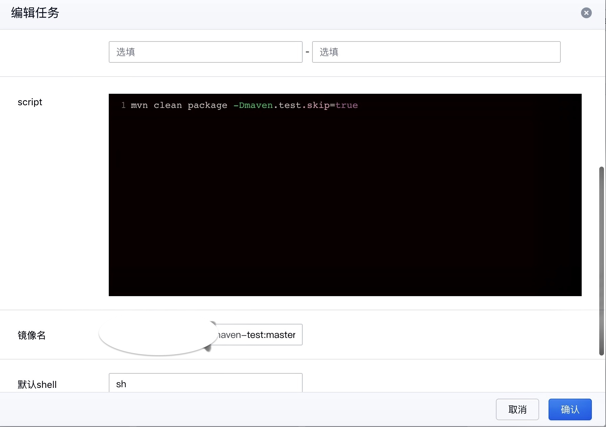
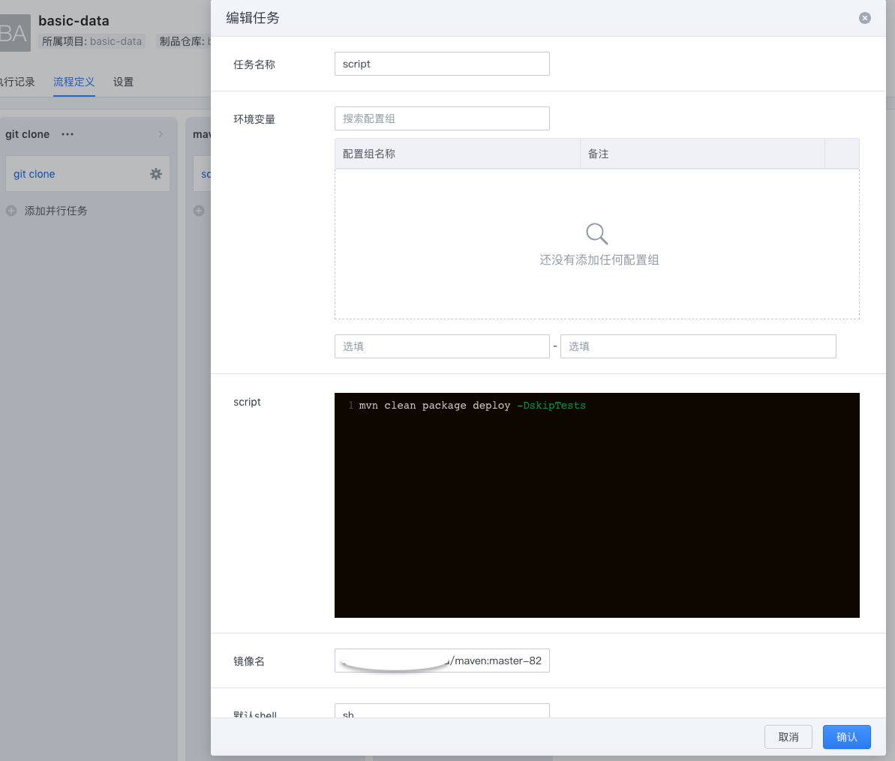

# maven-for-dcs
A Maven mirroring and sources with settings.xml configuration files encapsulated for DCS pipeline packaging Java applications.

* 该项目主要提供了一个用于 DCS 流水线打包 Java 应用的 Maven 镜像, 用于在 DCS 流水线构建的时候使用本地 Nexus 仓库，加快构建速度。
* 可通过参考该项目中的配置，用于在 DCS 流水线的时候将被依赖的项目或 Jar 包推送到 Nexus 仓库中。
* 引用该依赖的项目在 DCS 流水线的时候拉取依赖，随后打包构建镜像。

## Maven 镜像构建说明
### 1.自定义settings.xml文件
在配置文件中配置有上传 jar 包权限的账户/密码。如果后续步骤中上传不了，需要在 Nexus 的目标仓库（比如nexus-releases）中开启“Allow Redeploy”。
```xml
<?xml version="1.0" encoding="UTF-8"?>
<settings xmlns="http://maven.apache.org/SETTINGS/1.0.0"
          xmlns:xsi="http://www.w3.org/2001/XMLSchema-instance"
          xsi:schemaLocation="http://maven.apache.org/SETTINGS/1.0.0 http://maven.apache.org/xsd/settings-1.0.0.xsd">
          
    <servers>
        <server>
            <id>nexus-releases</id>
            <username>admin</username>
            <password>admin123</password>
        </server>
                
        <server>
            <id>nexus-snapshots</id>
            <username>admin</username>
            <password>admin123</password>
        </server>
    </servers>
 ······
</settings> 
```

### 2.Dockerfile 文件
基于 maven 镜像，通过自定义 settings.xml 文件覆盖默认配置。

```shell
FROM maven:3.5.2-jdk-8-alpine
LABEL maintainer “info@daocloud.io"
COPY settings.xml /root/.m2/
```

### 3. 构建 Maven 镜像
克隆本项目到本地，通过Docker build构建，然后将镜像推送到镜像仓库。

另外也可以通过 DCS 构建镜像，在 DCS 中创建对应的项目，然后创建流水线，并进行镜像构建和推送。


## 使用场景一：只需要进行 maven 构建和打包
此时无需修改先有项目的 pom 文件，而是只需在 DCS 的 maven 构建使用特定的 maven 镜像，以及指定构建命令即可。



## 使用场景二：A 项目依赖了 B 项目
### 1、在 B（被依赖项目）的 pom 文件中添加：
我们需要将 maven 打包的 jar 包推送至私有仓库，因此需要在项目的 pom.xml 文件中添加如下配置：

```xml
<distributionManagement>
	<repository>
		<!-- 注意此处需要和settings.xml中配置的id保持一致 -->
		<id>nexus-releases</id>
		<url>http://172.23.0.1:30003/repository/maven-public/</url>
	</repository>
    
	<snapshotRepository>
		<id>nexus-snapshots</id>
		<url>http://172.23.0.1:30003/repository/maven-public/</url>
	</snapshotRepository>
</distributionManagement>
```

同时在 DCS 的 maven 打包阶段使用如下命令将 jar 包发布至nexus仓库中：`mvn clean package deploy`




### 2、在 A（引用依赖的项目）的 pom 文件中添加如下内容：
如果你需要在你的项目中引用私有仓库的依赖，你需要使用 maven-for-dcs 的这个 settings.xml 文件覆盖自己本地的 settings.xml 配置或者在项目的 pom.xml 文件中添加如下配置：

```xml
<repositories>
	<repository>
		<id>nexus-releases</id>
		<url>http://172.23.0.1:30003/repository/maven-public/</url>
	</repository>
</repositories>
```

此步骤唯一的要求是：能够访问通配置中的 Nexus 仓库。:-D
